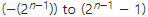
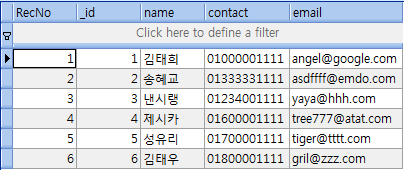
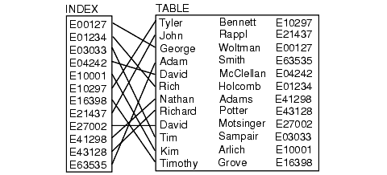
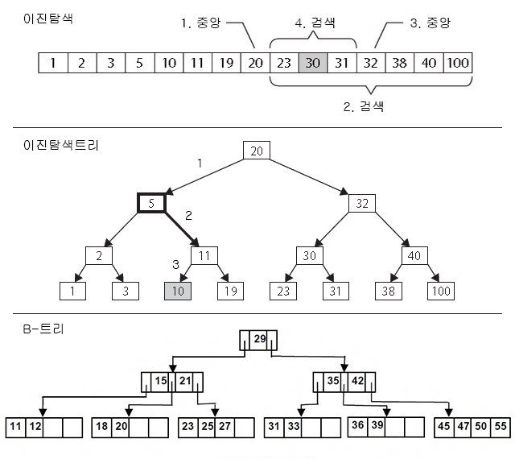

# 2. 데이터베이스 객체의 생성, 변경, 삭제
*실습 병행가*

## **2.1 데이터베이스 객체**

### **2.1.1 데이터베이스 객체**

데이터베이스 객체는 아래와 같은 특성을 가지고 있다.
 - 테이블이나 뷰, 인덱스 등 데이터베이스 내에 정의하는 모든 것을 일컫는 말
 - 객체는 이름을 가지며 중복할 수 없다.(동일 스키마 내에서)

객체는 다음과 같은 명명규칙에 따른다.
- 기존의 이름이나 예약어와 중복을 허용하지 않는다.  
  https://www.postgresql.org/docs/current/static/sql-keywords-appendix.html
- 숫자로 시작할 수 없으며 언더스코어(_) 이외의 기호는 사용할 수 없다.
- 한글을 사용할 때는 더블쿼트로 둘러싼다.(옵션)
- PostgreSQL에서는 객체명을 기본적으로 대소문자를 구분하지 않는다.(소문자화)  
  단, 더블쿼트(`"`)로 둘러싼 경우 대소문자를 구분한다.

```sql
postgres=# CREATE DATABASE ALL ENCODING='UTF8';    
ERROR:  syntax error at or near "ALL"
LINE 1: CREATE DATABASE ALL ENCODING='UTF8';
                        ^
postgres=# CREATE DATABASE abc-def ENCODING='UTF8';
ERROR:  syntax error at or near "-"
LINE 1: CREATE DATABASE abc-def ENCODING='UTF8';
                           ^
postgres=# CREATE DATABASE 4you ENCODING='UTF8';
ERROR:  syntax error at or near "4"
LINE 1: CREATE DATABASE 4you ENCODING='UTF8';
                        ^
postgres=# CREATE DATABASE si ENCODING='UTF8';
CREATE DATABASE
postgres=# CREATE DATABASE si ENCODING='UTF8';
ERROR:  database "si" already exists
```
```sql
postgres=# CREATE DATABASE ABC ENCODING='UTF8';
CREATE DATABASE
postgres=# CREATE DATABASE aBc ENCODING='UTF8';
ERROR:  database "abc" already exists
postgres=# CREATE DATABASE "ABC" ENCODING='UTF8';
CREATE DATABASE
postgres=# \l
                                  List of databases
    Name    |  Owner   | Encoding |   Collate   |    Ctype    |   Access privileges   
------------+----------+----------+-------------+-------------+-----------------------
 ABC        | postgres | UTF8     | en_US.UTF-8 | en_US.UTF-8 | 
 abc        | postgres | UTF8     | en_US.UTF-8 | en_US.UTF-8 | 
...
```

### **2.1.2 스키마**
앞서 설명한 객체를 담는 그릇으로 이름공간(namespace) 의 역할을 한다.  
스키마란 SQL 명령의 `DDL`을 이용하여 정의합니다.  
실제로 데이터베이스에 테이블을 작성해서 구축해나가는 작업을‘스키마 설계’라 부르기도 한다.

## **2.2 데이터베이스 생성, 변경, 삭제**

### **2.2.1 데이터베이스 생성**
```sql
CREATE DATABASE 데이터베이스명 옵션;
```
https://www.postgresql.org/docs/current/static/sql-createdatabase.html

```sql
postgres=# CREATE DATABASE si ENCODING='UTF8';
CREATE DATABASE
```

### **2.2.2 데이터베이스 변경**
```sql
ALTER DATABASE 데이터베이스명 옵션;
```
https://www.postgresql.org/docs/9.6/static/sql-alterdatabase.html

```sql
-- database 이름변경
postgres=# ALTER DATABASE si RENAME TO si_;
ALTER DATABASE
```

### **2.2.3 데이터베이스 삭제**
```sql
DROP DATABASE 데이터베이스명;
```
https://www.postgresql.org/docs/9.6/static/sql-dropdatabase.html
```sql
postgres=# DROP DATABASE si_;
DROP DATABASE
```

## **2.3 자료형**
데이터의 형태로 테이블의 열에 저장될 수 있는 데이터의 유형을 제한한다.`  
저장소의 사용공간과 밀접한 관계가 있다.  
https://www.postgresql.org/docs/current/static/datatype.html

### **2.3.1 수치형**
| Name | Aliases | Storage Size | Description |
| ---- | ------- | ------------ | ----------- |
| smallint | int2 | 2바이트 | 정수 (-32768 ~ 32767) |
| integer | int, int4 | 4바이트 | 정수 (-2147483648 ~ 2147483647) |
| bigint | int8 | 8바이트 | 정수 (-9223372036854775808 ~ 9223372036854775807) |
| numeric [ (p, s) ] | decimal [ (p, s) ] | 가변 | 정밀도를 선택할 수 있는 고정밀 수치 |
| real | float4 | 4바이트 | 단 정밀도 부동소수점 (6자리) |
| double precision | float8 | 8바이트 | 배 정밀도 부동소수점 (15자리) |
| smallserial | serial2 | 2바이트 | 자동증가형 정수 (1 ~ 32767) |
| serial | serial4 | 4바이트 | 자동증가형 정수 (1 ~ 2147483647) |
| bigserial | serial8 | 8바이트 | 자동증가형 정수 (1 ~ 9223372036854775807) |

※ unsigned(부호없음)로 지정할 수 없다.　범위는   
※ https://www.postgresql.org/docs/current/static/datatype-numeric.html  


### **2.3.2 문자형**
| Name | Aliases | Description |
| ---- | ------- | ----------- |
| character [ (n) ] | char [ (n) ] | 고정길이 문자열 |
| character varying [ (n) ] | varchar [ (n) ] | 가변길이 문자열 |
| text |   | 제한없는 가변길이 문자열 |

※ text는 표준SQL에 없다.  
※ https://www.postgresql.org/docs/current/static/datatype-character.html

### **2.3.3 날짜/시간형**
| Name | Aliases | Description |
| ---- | ------- | ----------- |
| date |   | 달력 날짜 (년, 월, 일) |
| interval [ fields ] [ (p) ] |   | 시간 간격 |
| time [ (p) ] [ without time zone ] |   | 타임존 없는시간 |
| time [ (p) ] with time zone | timetz | 타임존을 포함한 시간 |
| timestamp [ (p) ] [ without time zone ] |   | 타임존 없는 날짜시간 |
| timestamp [ (p) ] with time zone | timestamptz | 타임존을 포함한 날짜시간 |

※ https://www.postgresql.org/docs/current/static/datatype-datetime.html

예)
```
1999-01-08
04:05:06
04:05:06.789
1999-01-08 04:05:06
```

### **2.3.4 논리 진리형**
| Name | Aliases | Description | 
| ---- | ------- | ----------- |
boolean | bool | 참/거짓 (true/false)

※ https://www.postgresql.org/docs/current/static/datatype-boolean.html

### **2.3.5 열거형(ENUM)**
저장될 값을 미리 지정할 수 있는 형으로 *TYPE* 로 지정한다.  
지정된 값 이외에는 저장될 수 없다.
```sql
CREATE TYPE mood AS ENUM ('sad', 'ok', 'happy');
CREATE TABLE person (
    name text,
    current_mood mood
);
```
※ https://www.postgresql.org/docs/current/static/datatype-enum.html

### **2.3.6 기하형(Geometric)**
| Name | Aliases | Storage Size | Description |
| ---- | ------- | ------------ | ----------- |
| box |  | 32 bytes | rectangular box on a plane |
| circle |  | 24 bytes | circle on a plane |
| line |  | 32 bytes | infinite line on a plane |
| lseg |  | 32 bytes | line segment on a plane |
| path |   | 16+16n bytes | geometric path on a plane |
| point |  | 16 bytes | geometric point on a plane |
| polygon |  | 40+16n bytes | closed geometric path on a plane |

※ https://www.postgresql.org/docs/current/static/datatype-geometric.html

### **2.3.7 그밖**
비트, 문자검색, JSON, XML등의 데이터형이 있다.

## **2.4 테이블 작성·삭제·변경**
테이블 또한 CREATE로 작성, DROP으로 삭제, ALTER로 변경할 수 있다.

### **2.4.1 테이블**
말 그대로 표를 의미하며 수직의 열과 수평의 행의 모델을 사용해 조직된 데이터들의 집합을 말한다.  

테이블의 예)  


### **2.4.2 테이블 작성**
테이블은 데이터베이스 상에서 작성할 수 있다.  
CREATE TABLE 명령을 정의할 열과 제약등을 콤마(,)로 구분하여 연속해 지정한다.

```sql
CREATE TABLE 테이블명 (
  열 정의 1,
  열 정의 2,
  …
);
```
https://www.postgresql.org/docs/current/static/sql-createtable.html

열을 정의할 때
- 열의 이름을 명명규칙에 맞게 지정한다.
- 데이터형과 길이(괄호안에 지정)를 지정한다.
- 필요에 따라 기본값이나 제약을 지정한다.

```sql
CREATE TABLE test (
  no INTEGER NOT NULL,
  a VARCHAR(30),
  b TIMESTAMP NOT NULL DEFAULT CURRENT_TIMESTAMP
);
```
```sql
postgres=# CREATE DATABASE si ENCODING='UTF8';
CREATE DATABASE
postgres=# \c si
You are now connected to database "si" as user "postgres".
si=# CREATE TABLE test (
si(#   no INTEGER NOT NULL,
si(#   a VARCHAR(30),
si(#   b TIMESTAMP NOT NULL DEFAULT CURRENT_TIMESTAMP
si(# );
CREATE TABLE
si=# \d
 public | test | table | postgres

si=# \d test;
                      Table "public.test"
 Column |            Type             |       Modifiers
--------+-----------------------------+------------------------
 no     | integer                     | not null
 a      | character varying(30)       |
 b      | timestamp without time zone | not null default now()
 ```

### **2.4.3 테이블 변경**
ALTER TABLE 명령을 사용하면 테이블에 저장되어 있는 데이터는 그대로 남긴 채 구성만 변경할 수 있다.  
```sql
ALTER TABLE 테이블명 변경명령
```
https://www.postgresql.org/docs/current/static/sql-altertable.html

ALTER TABLE로 할 수 있는 일은 크게 다음과 같이 두 가지로 분류할 수 있다.
- 열의 추가, 변경, 삭제
- 제약의 추가, 삭제

**1. 열 추가**
```sql
ALTER TABLE 테이블명 ADD 열 정의
```
열 정의는 CREATE TABLE의 경우와 동일하다.  
즉, 열 이름, 데이터형과 필요에 따라 기본값과 제약을 지정한다.  
물론 열의 이름이 중복되면 열을 추가할 수 없다. 

주의할 점은 다음과 같다.(NOT NULL에 관해서는 2.5 제약에서 설명)
- 기존에 데이터 행이 존재하는 경우에는 추가한 열의 값이 모두 NULL이 된다.  
  단, 기본값이 지정된 경우는 기본값으로 저장된다.
- NOT NULL 제약을 붙인 열을 추가하고 싶다면  
  NULL 이외의 값으로 기본값을 지정할 필요가 있습니다.  
  지정하지 않으면 제약위반으로 오류가 발생하며 열을 추가할 수 없게 된다.

```sql
si=# INSERT INTO test VALUES(1, 'test1', NOW());
INSERT 0 1
si=# SELECT * FROM test;
 no |   a   |             b
----+-------+----------------------------
  1 | test1 | 2017-10-01 00:41:49.404825
(1 row)

si=# ALTER TABLE test ADD no1 INTEGER NOT NULL;
ERROR:  column "no1" contains null values
si=# ALTER TABLE test ADD no1 INTEGER NOT NULL DEFAULT 0;
ALTER TABLE
si=# ALTER TABLE test ADD no2 INTEGER;
ALTER TABLE
si=# SELECT * FROM test;
 no |   a   |             b              | no1 | no2
----+-------+----------------------------+-----+-----
  1 | test1 | 2017-10-01 00:41:49.404825 |   0 |
(1 row)

si=# \d test;
                      Table "public.test"
 Column |            Type             |       Modifiers
--------+-----------------------------+------------------------
 no     | integer                     | not null
 a      | character varying(30)       |
 b      | timestamp without time zone | not null default now()
 no1    | integer                     | not null default 0
 no2    | integer                     |
```

**2. 열 속성 변경**
```sql
ALTER TABLE 테이블명 ALTER 열 TYPE 데이터 형정의
ALTER TABLE 테이블명 ALTER 열 SET DEFAULT 정의
ALTER TABLE 테이블명 ALTER 열 DROP DEFAULT
```
ALTER로 데이터형이나 기본값, NOT NULL 제약 등의 속성을 변경할 수 있으며  
콤마(,)를 구분자로 복수를 지정할 수 있다.  
열의 이름은 ALTER로 변경할 수 없다.  

```sql
si=# ALTER TABLE test ALTER no2 TYPE VARCHAR(10), ALTER no2 SET DEFAULT 'a';
ALTER TABLE
si=# SELECT * FROM test;
 no |   a   |             b              | no1 | no2
----+-------+----------------------------+-----+-----
  1 | test1 | 2017-10-01 00:46:21.785046 | 0   |
(1 row)

si=# \d test;
                          Table "public.test"
 Column |            Type             |           Modifiers
--------+-----------------------------+--------------------------------
 no     | integer                     | not null
 a      | character varying(30)       |
 b      | timestamp without time zone | not null default now()
 no1    | integer                     | not null default 0
 no2    | character varying(10)       | default 'a'::character varying
```
주의할 점으로는 
- 기존과 다른 데이터형으로 변경할 때 경우에 따라 *USING*을 사용해 형 변환을 지정할 필요가 있다.
- 데이터형의 사이즈를 줄이는 경우 기존의 데이터가 지정한 사이즈 보다 큰 경우 오류가 발생한다.

**3. 열 이름 변경**
```sql
ALTER TABLE 테이블명 RENAME 기존 열 이름 TO 신규 열 이름
```
RENAME로 열의 이름을 변경할 수 있다.

```sql
si=# ALTER TABLE test RENAME no2 TO c;
ALTER TABLE
si=# \d test;
                          Table "public.test"
 Column |            Type             |           Modifiers
--------+-----------------------------+--------------------------------
 no     | integer                     | not null
 a      | character varying(30)       |
 b      | timestamp without time zone | not null default now()
 no1    | integer                     | not null default 0
 c      | character varying(6)        | default 'a'::character varying
```

**4. 열 삭제**
```sql
ALTER TABLE 테이블명 DROP 열명
```
DROP으로 열을 삭제할 수 있으며 모든 행의 해당 열의 데이터 또한 삭제된다.

```sql
si=# ALTER TABLE test DROP no1;
ALTER TABLE
si=# \d test;
                          Table "public.test"
 Column |            Type             |           Modifiers
--------+-----------------------------+--------------------------------
 no     | integer                     | not null
 a      | character varying(30)       |
 b      | timestamp without time zone | not null default now()
 c      | character varying(6)        | default 'a'::character varying
```

### **2.4.4 테이블 이름변경**
테이블의 이름을 변경할때도 ALTER TABLE을 사용한다.  
물론 변경할 테이블 명이 중복되어서는 안된다.
```sql
ALTER TABLE 기존 테이블명 RENAME TO 신규 테이블명
```
```sql
si=# ALTER TABLE test RENAME TO test_;
ALTER TABLE
si=# \d
         List of relations
 Schema | Name  | Type  |  Owner
--------+-------+-------+----------
 public | test_ | table | postgres
(1 row)
```

### **2.4.5 테이블 삭제**
DROP TABLE 명령은 데이터베이스에서 테이블을 삭제할 수 있다.  
테이블 안의 모든 데이터와 테이블이 삭제되므로 신중하게 할 필요가 있다.

```sql
DROP TABLE 테이블명
```
https://www.postgresql.org/docs/current/static/sql-droptable.html
```sql
si=# DROP TABLE test_;
DROP TABLE
si=# \d
No relations found.
```

테이블은 삭제하지 않고 안의 모든 데이터를 삭제할 경우에는 TRUNCATE TABLE 명령을 사용한다.
```sql
TRUNCATE TABLE 테이블명
```

## **2.5 제약**

테이블 작성시에 입력하는 자료에 대해서 제약을 지정할 수 있다.  
이는 데이터 무결성을 지키기 위한 것으로 제약에 위배된다면 오류가 발생한다.  
아래와 같은 제약을 정의할 수 있으며
- NOT NULL
- UNIQUE
- PRIMARY KEY
- FOREIGN KEY

이외에도 CHECK, EXCLUDE가 있다.  
NOT NULL이외의 제약에는 이름을 붙일수 있으며 CONSTRAINT 키워드를 사용해 지정할 수도 있다.  
이름을 지정하지 않은 경우에는 임의의 이름이 자동으로 지정된다.  
https://www.postgresql.org/docs/current/static/ddl-constraints.html

### **2.5.1 NOT NULL**
유효한 값이 입력되도록 열에 NOT NULL 제약을 지정할 수 있다.  
NULL값이 입력되면 오류가 발생한다.

```sql
CREATE TABLE test0 (
  a INTEGER NOT NULL,
  b INTEGER NOT NULL,
  c INTEGER
);
```
```sql
si=# CREATE TABLE test0 (
si(#   a INTEGER NOT NULL,
si(#   b INTEGER NOT NULL,
si(#   c INTEGER
si(# );
CREATE TABLE
si=# INSERT INTO test0 VALUES(1,11,111);
INSERT 0 1
si=# INSERT INTO test0 VALUES(2,NULL,222);
ERROR:  null value in column "b" violates not-null constraint
DETAIL:  Failing row contains (2, null, 222).
si=# SELECT * FROM test0;
 a | b  |  c
---+----+-----
 1 | 11 | 111
(1 row)
```

**추가 및 삭제**
```sql
ALTER TABLE 테이블명 ALTER 열 SET NOT NULL
ALTER TABLE 테이블명 ALTER 열 DROP NOT NULL
```
```sql
si=# ALTER TABLE test0 ALTER b DROP NOT NULL;
ALTER TABLE
si=# \d test0
     Table "public.test0"
 Column |  Type   | Modifiers
--------+---------+-----------
 a      | integer | not null
 b      | integer |
 c      | integer |

si=# ALTER TABLE test0 ALTER b SET NOT NULL;
ALTER TABLE
si=# \d test0
     Table "public.test0"
 Column |  Type   | Modifiers
--------+---------+-----------
 a      | integer | not null
 b      | integer | not null
 c      | integer |
```

### **2.5.2 UNIQUE**
열에 유일한 값이 입력되도록 UNIQUE 제약을 지정할 수 있으며
아래와 같은 특성을 가진다.
- 유일성에 위배되는 중복되는 값이 입력되는 경우 오류가 발생한다.
- NULL과 NOT NULL의 제약을 함께 사용할 수 있다.
- NULL값에 대해서는 유일성이 적용되지 않는다.
- 여러개 열을 지정할 수 있으며 복수의 열을 묶어서 지정할 수도 있다.
- INSERT나 UPDATE시에 적용된다.

```sql
CREATE TABLE test (
  a INTEGER NOT NULL,
  b INTEGER NOT NULL,
  c INTEGER UNIQUE
);

CREATE TABLE test_1 (
  a INTEGER NOT NULL,
  b INTEGER NOT NULL,
  c INTEGER,
  UNIQUE (a, b)
);
```

```sql
si=# CREATE TABLE test (
si(#   a INTEGER NOT NULL,
si(#   b INTEGER NOT NULL,
si(#   c INTEGER UNIQUE
si(# );
CREATE TABLE
si=# \d test
     Table "public.test"
 Column |  Type   | Modifiers
--------+---------+-----------
 a      | integer | not null
 b      | integer | not null
 c      | integer |
Indexes:
    "test_c_key" UNIQUE CONSTRAINT, btree (c)

si=# INSERT INTO test VALUES(1,11,111);
INSERT 0 1
si=# INSERT INTO test VALUES(2,22,111);
ERROR:  duplicate key value violates unique constraint "test_c_key"
DETAIL:  Key (c)=(111) already exists.
si=# INSERT INTO test VALUES(3,33,NULL);
INSERT 0 1
si=# SELECT * FROM test;
 a | b  |  c
---+----+-----
 1 | 11 | 111
 3 | 33 |
(2 rows)
```

**추가 및 삭제**
```sql
ALTER TABLE 테이블명 ADD UNIQUE (열, ..)
ALTER TABLE 테이블명 ADD CONSTRAINT 이름 UNIQUE (열, ..)
ALTER TABLE 테이블명 DROP CONSTRAINT 이름
```
```sql
si=# ALTER TABLE test DROP CONSTRAINT test_c_key;
ALTER TABLE
si=# \d test
     Table "public.test"
 Column |  Type   | Modifiers
--------+---------+-----------
 a      | integer | not null
 b      | integer | not null
 c      | integer |

si=# ALTER TABLE test ADD UNIQUE (c);
ALTER TABLE
si=# \d test
     Table "public.test"
 Column |  Type   | Modifiers
--------+---------+-----------
 a      | integer | not null
 b      | integer | not null
 c      | integer |
Indexes:
    "test_c_key" UNIQUE CONSTRAINT, btree (c)
```

### **2.5.3 PRIMARY KEY**
기본키라 불리며 테이블에서 행을 식별하기 위한 값으로 사용되고 유일한 값이 입력된다.  
아래와 같은 특성을 가진다.
- UNIQUE + NOT NULL의 특성을 가진다.
- UNQUE와 달리 테이블당 하나만 지정할 수 있다.
- 복수의 열을 묶어서 지정할 수 있다.
- INSERT나 UPDATE시에 적용된다.

```sql
CREATE TABLE test1 (
  a INTEGER PRIMARY KEY,
  b INTEGER NOT NULL,
  c INTEGER
);

CREATE TABLE test1_1 (
  a INTEGER NOT NULL,
  b INTEGER NOT NULL,
  c INTEGER,
  PRIMARY KEY (a, b)
);
```

```sql
si=# CREATE TABLE test1 (
si(#   a INTEGER PRIMARY KEY,
si(#   b INTEGER NOT NULL,
si(#   c INTEGER
si(# );
CREATE TABLE
si=# \d test1
     Table "public.test1"
 Column |  Type   | Modifiers
--------+---------+-----------
 a      | integer | not null
 b      | integer | not null
 c      | integer |
Indexes:
    "test1_pkey" PRIMARY KEY, btree (a)

si=# INSERT INTO test1 VALUES(1,11,111);
INSERT 0 1
si=# INSERT INTO test1 VALUES(NULL,22,222);
ERROR:  null value in column "a" violates not-null constraint
DETAIL:  Failing row contains (null, 22, 222).
si=# INSERT INTO test1 VALUES(1,22,222);
ERROR:  duplicate key value violates unique constraint "test1_pkey"
DETAIL:  Key (a)=(1) already exists.
si=# SELECT * FROM test1;
 a | b  |  c
---+----+-----
 1 | 11 | 111
(1 row)
```

**추가 및 삭제**
```sql
ALTER TABLE 테이블명 ADD PRIMARY KEY (열, ..)
ALTER TABLE 테이블명 ADD CONSTRAINT 이름 PRIMARY KEY (열, ..)
ALTER TABLE 테이블명 DROP CONSTRAINT 이름
```
```sql
si=# ALTER TABLE test1 DROP CONSTRAINT test1_pkey;
ALTER TABLE
si=# \d test1
     Table "public.test1"
 Column |  Type   | Modifiers
--------+---------+-----------
 a      | integer | not null
 b      | integer | not null
 c      | integer |

si=# ALTER TABLE test1 ADD PRIMARY KEY (a);
ALTER TABLE
si=# \d test1
     Table "public.test1"
 Column |  Type   | Modifiers
--------+---------+-----------
 a      | integer | not null
 b      | integer | not null
 c      | integer |
Indexes:
    "test1_pkey" PRIMARY KEY, btree (a)
```

### **2.5.4 FOREIGN KEY**
외부의 키를 참조해 테이블의 열의 값으로 사용하도록 제약한다.  
참조되는 테이블은 부모 테이블, 참조하려는 테이블(외부키가 지정된 테이블)은 자식 테이블이라 불리며  
아래와 같은 특성을 가진다.
- 부모 테이블의 열은 유일성을 가진 Primary Key나 Unique여야 한다.
- 부모 테이블의 열에 존재하지 않는 값은 자식 테이블에서 사용(INSERT나 UPDATE시)될 수 없다.  
  단, NOT NULL 제약이 없다면 NULL을 지정할 수 있다.
- 자식 테이블의 열의 데이터형은 부모 테이블의 열의 데이터형과 호환되어야 된다.
- 자식 테이블이 참조하는 데이터는 부모 테이블에서 기본적으로 삭제할 수 없다.  
  (ON DELETE CASCADE로 제어가능)
- 여러개의 열을 지정할 수 있으며 복수의 열을 묶어서 지정할 수도 있다.

```sql
CREATE TABLE test2 (
  a INTEGER NOT NULL,
  b INTEGER NOT NULL,
  c INTEGER REFERENCES test1 (a)
);

CREATE TABLE test2_1 (
  a INTEGER NOT NULL,
  b INTEGER NOT NULL,
  c INTEGER,
  FOREIGN KEY (c) REFERENCES test (c)
);
```
```sql
si=# CREATE TABLE test2 (
si(#   a INTEGER NOT NULL,
si(#   b INTEGER NOT NULL,
si(#   c VARCHAR(100),
si(#   FOREIGN KEY (c) REFERENCES test (c)
si(# );
ERROR:  foreign key constraint "test2_c_fkey" cannot be implemented
DETAIL:  Key columns "c" and "c" are of incompatible types: character varying and integer.
si=# CREATE TABLE test2 (
si(#   a INTEGER NOT NULL,
si(#   b INTEGER NOT NULL,
si(#   c INTEGER,
si(#   FOREIGN KEY (c) REFERENCES test (c)
si(# );
CREATE TABLE
si=# \d test2
     Table "public.test2"
 Column |  Type   | Modifiers
--------+---------+-----------
 a      | integer | not null
 b      | integer | not null
 c      | integer |
Foreign-key constraints:
    "test2_c_fkey" FOREIGN KEY (c) REFERENCES test(c)

si=# SELECT * FROM test;
 a | b  |  c
---+----+-----
 1 | 11 | 111
 3 | 33 |
(2 rows)

si=# INSERT INTO test2 VALUES(1,11,NULL);
INSERT 0 1
si=# INSERT INTO test2 VALUES(2,22,222);
ERROR:  insert or update on table "test2" violates foreign key constraint "test2_c_fkey"
DETAIL:  Key (c)=(222) is not present in table "test".
si=# INSERT INTO test2 VALUES(2,22,111);
INSERT 0 1
si=# SELECT * FROM test2;
 a | b  |  c
---+----+-----
 1 | 11 |
 2 | 22 | 111
(2 rows)

si=# DELETE FROM test WHERE a = 1;
ERROR:  update or delete on table "test" violates foreign key constraint "test2_c_fkey" on table "test2"
DETAIL:  Key (c)=(111) is still referenced from table "test2".
si=# DROP TABLE test;
ERROR:  cannot drop table test because other objects depend on it
DETAIL:  constraint test2_c_fkey on table test2 depends on table test
HINT:  Use DROP ... CASCADE to drop the dependent objects too.
```

**추가 및 삭제**
```sql
ALTER TABLE 테이블명 ADD FOREIGN KEY (열, ..) REFERENCES 참조 테이블명 (참조 열, ..)
ALTER TABLE 테이블명 ADD CONSTRAINT 이름 FOREIGN KEY (열, ..) REFERENCES 참조 테이블명 (참조 열, ..)
ALTER TABLE 테이블명 DROP CONSTRAINT 이름
```
```sql
si=# ALTER TABLE test2 DROP CONSTRAINT test2_c_fkey;
ALTER TABLE
si=# \d test2
     Table "public.test2"
 Column |  Type   | Modifiers
--------+---------+-----------
 a      | integer | not null
 b      | integer | not null
 c      | integer |

-- ON DELETE CASCADE도 추가
si=# ALTER TABLE test2 ADD FOREIGN KEY (c) REFERENCES test (c) ON DELETE CASCADE;
ALTER TABLE
si=# \d test2
     Table "public.test2"
 Column |  Type   | Modifiers
--------+---------+-----------
 a      | integer | not null
 b      | integer | not null
 c      | integer |
Foreign-key constraints:
    "test2_c_fkey" FOREIGN KEY (c) REFERENCES test(c) ON DELETE CASCADE

si=# DELETE from test where a = 1;
DELETE 1
si=# SELECT * FROM test;
 a | b  | c
---+----+---
 3 | 33 |
(1 row)

si=# SELECT * FROM test2;
 a | b  | c
---+----+---
 1 | 11 |
(1 row)
```

## **2.6 인덱스**

### **2.6.1 인덱스**
인덱스는
- 테이블의 색인과 같은 것으로 검색 속도의 향상시키기 위한 자료구조를 말한다.  
  여기서 ‘검색’이란 SELECT/UPDATE/DELETE 명령에 WHERE 구에 조건을 지정하고 그에 일치하는 행을 찾는 과정을 말한다.
- 인덱스 내의 값들은 검색을 용이하도록 하기 위해 `정렬`된 상태로 유지된다.  
  이로 인해 INSERT/UPDATE/DELETE 명령이 실행될 경우의 경우는 인덱스 갱신을 위한 비용이 발생한다.
- 제약의 구현에도 이용된다.
- 테이블과는 별개의 데이터베이스 객체로 작성되나 테이블에 의존적이다.
- 인덱스를 지정해도 사용되지 않는 경우(순차적 탐색)가 있다.(planner가 선택)



**구현 예**


### **2.6.2 인덱스 종류**
PostgreSQL에서 지원하는 인덱스
 - B-tree :가장 보편적으로 사용(기본값)
 - Hash : 키 룩업에 특화된 인덱스
 - GiST, GIN : 전문(Full Text) 검색용

### **2.6.3 인덱스 작성**
CREATE INDEX 명령으로 작성할 수 있다.  
해당 인덱스가 어느 테이블의 어느 열에 관한 것인지 지정할 필요가 있으며 복수로 지정할 수도 있다.

```sql
CREATE INDEX ON 테이블명 (열1, 열2...);
CREATE INDEX 인덱스명 ON 테이블명 (열1, 열2...);
```
https://www.postgresql.org/docs/current/static/sql-createindex.html

```sql
si=# \d test1
     Table "public.test1"
 Column |  Type   | Modifiers
--------+---------+-----------
 a      | integer | not null
 b      | integer | not null
 c      | integer |
Indexes:
    "test1_pkey" PRIMARY KEY, btree (a)

si=# CREATE INDEX ON test1 (b);
CREATE INDEX
si=# \d test1
     Table "public.test1"
 Column |  Type   | Modifiers
--------+---------+-----------
 a      | integer | not null
 b      | integer | not null
 c      | integer |
Indexes:
    "test1_pkey" PRIMARY KEY, btree (a)
    "test1_b_idx" btree (b)
```

### **2.6.4 인덱스 삭제**
DROP INDEX 명령으로 삭제할 수 있다.  
다만 테이블내에 객체를 작성할 경우에는 테이블의 이름도 지정할 필요가 있다.  
(이때 인덱스를 구성하는 열은 지정할 필요가 없다)

```sql
DROP INDEX 인덱스명
```
https://www.postgresql.org/docs/current/static/sql-dropindex.html

```sql
si=# DROP INDEX test1_b_idx;
DROP INDEX
si=# \d test1
     Table "public.test1"
 Column |  Type   | Modifiers
--------+---------+-----------
 a      | integer | not null
 b      | integer | not null
 c      | integer |
Indexes:
    "test1_pkey" PRIMARY KEY, btree (a)
```
