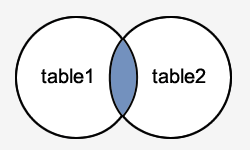

# 6. 복수의 테이블 다루기

## **6.1 집합연산**
관계형 데이터베이스의 관계형은 수학의 집합의 관계형 이론에서 유래했다.  
이로 인해 집합(중복을 허용하는 중복집합)의 개념으로 데이터를 다룰 수 있다.

아래는 합집합, 교집합, 차집합의 문법으로 ALL을 생략하면 중복값을 제거(행 단위)한다.
```sql
query1 UNION [ALL] query2
query1 INTERSECT [ALL] query2
query1 EXCEPT [ALL] query2
```

### **6.1.1 UNION(합집합)**
```sql
-- 중복제거하지 않은 경우
서울연구원=# SELECT UNNEST(ARRAY[1,2,3,1,2])
UNION ALL
SELECT UNNEST(ARRAY[2,3,2]);
 unnest
--------
      1
      2
      3
      1
      2
      2
      3
      2
(8 rows)

-- 중복제거한 경우
서울연구원=# SELECT UNNEST(ARRAY[1,2,3,1,2])
UNION
SELECT UNNEST(ARRAY[2,3,2]);
 a
---
 1
 3
 2
(3 rows)
```

### **6.1.2 INTERSECT(교집합)**
```sql
-- 중복제거하지 않은 경우
서울연구원=# SELECT UNNEST(ARRAY[1,2,3,1,2])
INTERSECT ALL
SELECT UNNEST(ARRAY[2,3,2]);
 unnest
--------
      2
      2
      3
(3 rows)

-- 중복제거하지 않은 경우 - 2,3으로 교집합한 경우로 위와 결과가 다르다.
서울연구원=# SELECT UNNEST(ARRAY[1,2,3,1,2])
INTERSECT ALL
SELECT UNNEST(ARRAY[2,3]);
 unnest
--------
      2
      3
(2 rows)

-- 중복제거한 경우
서울연구원=# SELECT UNNEST(ARRAY[1,2,3,1,2])
INTERSECT
SELECT UNNEST(ARRAY[2,3,2]);
 unnest
--------
      2
      3
(2 rows)
```

### **6.1.3 EXCEPT(차집합)**
차집합으로 왼쪽에서 오른쪽을 뺀 경우가 된다.
```sql
-- 중복제거하지 않은 경우
서울연구원=# SELECT UNNEST(ARRAY[1,2,3,1,2])
EXCEPT ALL
SELECT UNNEST(ARRAY[2,3,2]);
 unnest
--------
      1
      1
(2 rows)

-- 중복제거하지 않은 경우 - 2,3으로 차집합한 경우로 위와 결과가 다르다.
서울연구원=# SELECT UNNEST(ARRAY[1,2,3,1,2])
EXCEPT ALL
SELECT UNNEST(ARRAY[2,3]);
 unnest
--------
      1
      1
      2
(3 rows)

-- 중복제거한 경우
서울연구원=# SELECT UNNEST(ARRAY[1,2,3,1,2])
EXCEPT
SELECT UNNEST(ARRAY[2,3,2]);
 unnest
--------
      1
(1 rows)
```

### **6.1.4 집합연산의 공통 룰**
앞서 언급한 것처럼 ALL을 생략하면 중복값을 제거(행 단위)되는것 이외에 공통적으로 적용되는 룰이 있다.  
예제 테이블들의 정의를 확인해보자.
```sql
서울연구원=# \d sample41
                     Table "public.sample41"
 Column |         Type          |            Modifiers
--------+-----------------------+---------------------------------
 no     | integer               | not null default 0
 a      | character varying(30) | default NULL::character varying
 b      | date                  |

서울연구원=# \d sample51
           Table "public.sample51"
  Column  |         Type          | Modifiers
----------+-----------------------+-----------
 no       | integer               |
 name     | character varying(20) |
 quantity | integer               |
```

룰은 아래와 같다.
- 각 쿼리의 열은 개수가 동일해야 되며 열 단위로 자료형이 동일해야 된다.
```sql
서울연구원=# SELECT no, a FROM sample41 UNION SELECT no FROM sample51;
ERROR:  each UNION query must have the same number of columns
LINE 1: SELECT no, a FROM sample41 UNION SELECT no FROM sample51;
                                                ^
서울연구원=# SELECT * FROM sample41 UNION SELECT * FROM sample51;
ERROR:  UNION types date and integer cannot be matched
LINE 1: select * from sample41 union select * from sample51;
                                            ^
```
- 집합연산결과의 열은 처음 지정한 쿼리의 열에 의존된다.
```sql
서울연구원=# SELECT no, a, 1 FROM sample41 UNION SELECT no, name, quantity FROM sample51;
 no |   a    | ?column?
----+--------+----------
  4 | C      |        3
  3 | def2   |        1
  2 | A      |        2
 11 | 김영희 |        1
  3 | B      |       10
 13 | 홍길동 |        1
  1 | abc    |        1
 14 | 이순신 |        1
  1 | A      |        1
  5 |        |
 12 | 박철수 |        1
  7 | ghi6   |        1
(12 rows)

서울연구원=# SELECT * FROM sample51 UNION SELECT no, a, 1 FROM sample41;
 no |  name  | quantity
----+--------+----------
  4 | C      |        3
  3 | def2   |        1
  2 | A      |        2
 11 | 김영희 |        1
  3 | B      |       10
 13 | 홍길동 |        1
  1 | abc    |        1
 14 | 이순신 |        1
  1 | A      |        1
  5 |        |
 12 | 박철수 |        1
  7 | ghi6   |        1
(12 rows)
```
- 집합연산한 결과를 정렬할 경우에는 문장의 맨 마지막에 ORDER BY구를 지정한다.  
  ORDER BY의 열명은 앞서 언급한 내용에 따른다.  
  물론 괄호로 묶어 각 쿼리 단위로 ORDER BY를 지정할 수 있다.  
```sql
서울연구원=# SELECT no, a FROM sample41 UNION SELECT no, name FROM sample51 ORDER BY a;
 no |   a
----+--------
 11 | 김영희
 12 | 박철수
 14 | 이순신
 13 | 홍길동
  2 | A
  1 | A
  1 | abc
  3 | B
  4 | C
  3 | def2
  7 | ghi6
  5 |
(12 rows)

서울연구원=# SELECT no, a FROM sample41 UNION SELECT no, name FROM sample51 ORDER BY name;
ERROR:  column "name" does not exist
LINE 1: ... sample41 UNION SELECT no, name FROM sample51 ORDER BY name;
                                                                  ^
HINT:  There is a column named "name" in table "*SELECT* 2", but it cannot be referenced from this part of the query.
```
```sql
-- 괄호로 묶어 쿼리를 따로 정렬한 경우
서울연구원=# SELECT no, a FROM sample41 UNION (SELECT no, name FROM sample51 ORDER BY name);
 no |   a
----+--------
 12 | 박철수
  1 | A
  3 | B
 11 | 김영희
  5 |
  3 | def2
  4 | C
  7 | ghi6
  1 | abc
 14 | 이순신
 13 | 홍길동
  2 | A
(12 rows)
```

## **6.2 테이블 결합**
관계형 데이터베이스에서 중요한 개념중에 하나인 JOIN통해 테이블 결합을 할 수 있다.  
집합연산은 행에, 테이블 결합은 열(행+열인 경우도 있다)에 관련된다.  
결합은 아래와 같이 크게 3종류로 나뉜다.
- 교차결합(CROSS JOIN)
- 내부결합(INNER JOIN)
- 외부결합(OUTER JOIN)

여기에서 내부결합과 외부결합의 이용도가 아주 높다.  
이외에 결합의 방법에 관한 것으로 NATURAL JOIN과 SELF JOIN을 들 수 있다.  

### **6.2.1 곱집합과 CROSS JOIN**
곱집합은 합집합이나 교집합처럼 집합의 연산방법 중 하나로 적집합 또는 카티전곱(Cartesian product)이라고도 불린다.  


**CROSS JOIN**  
교차결합은 테이블들을 곱집합으로 결합하는 방법을 말하는데  
아래처럼 콤마(,)를 구분자로 테이블을 나열한다.
```sql
FROM 테이블명1, 테이블명2, ...
```
```sql
서울연구원=# SELECT * FROM orders;
 id | maker_id |  ordered
----+----------+------------
  1 |        1 | 2017-10-01
  2 |        3 | 2017-10-01
  3 |        1 | 2017-10-01
  4 |        3 | 2017-10-02
  5 |        1 | 2017-10-03
(5 rows)

서울연구원=# SELECT * FROM makers;
 id |  name
----+--------
  1 | AMD
  2 | INTEL
  3 | NVIDIA
(3 rows)

서울연구원=# SELECT * FROM orders, makers;
 id | maker_id |  ordered   | id |  name
----+----------+------------+----+--------
  1 |        1 | 2017-10-01 |  1 | AMD
  1 |        1 | 2017-10-01 |  2 | INTEL
  1 |        1 | 2017-10-01 |  3 | NVIDIA
  2 |        3 | 2017-10-01 |  1 | AMD
  2 |        3 | 2017-10-01 |  2 | INTEL
  2 |        3 | 2017-10-01 |  3 | NVIDIA
  3 |        1 | 2017-10-01 |  1 | AMD
  3 |        1 | 2017-10-01 |  2 | INTEL
  3 |        1 | 2017-10-01 |  3 | NVIDIA
  4 |        3 | 2017-10-02 |  1 | AMD
  4 |        3 | 2017-10-02 |  2 | INTEL
  4 |        3 | 2017-10-02 |  3 | NVIDIA
  5 |        1 | 2017-10-03 |  1 | AMD
  5 |        1 | 2017-10-03 |  2 | INTEL
  5 |        1 | 2017-10-03 |  3 | NVIDIA
(15 rows)
```

### **6.2.2 INNER JOIN**
내부결합은 앞서 언급한 교차집합에서 조건을 지정해 결합한 것을 말한다.  
내부결합에서는 조건에 합치하는 집합(교집합)을 반환한다.  
밴다이어그램으로 나타내면 아래와 같다.



문법은 다음과 같으며 INNER는 생략할 수 있다.
```sql
FROM 테이블1 INNER JOIN 테이블2 ON 결합조건
FROM 테이블1 JOIN 테이블2 ON 결합조건
```
orders와 makers을 각각의 orders.maker_id와 makers.id로 내부결합
```sql
서울연구원=# SELECT * FROM orders INNER JOIN makers ON makers.id = orders.maker_id;
 id | maker_id |  ordered   | id |  name
----+----------+------------+----+--------
  1 |        1 | 2017-10-01 |  1 | AMD
  2 |        3 | 2017-10-01 |  3 | NVIDIA
  3 |        1 | 2017-10-01 |  1 | AMD
  4 |        3 | 2017-10-02 |  3 | NVIDIA
  5 |        1 | 2017-10-03 |  1 | AMD
(5 rows)
```
교차결합한 결과에서 서로 조건에 일치하는 것을 찾아내면 위의 내부결합과 결과가 같아진다.
```sql
서울연구원=# SELECT * FROM orders, makers;
 id | maker_id |  ordered   | id |  name
----+----------+------------+----+--------
  1 |        1 | 2017-10-01 |  1 | AMD    -- <-
  1 |        1 | 2017-10-01 |  2 | INTEL
  1 |        1 | 2017-10-01 |  3 | NVIDIA
  2 |        3 | 2017-10-01 |  1 | AMD
  2 |        3 | 2017-10-01 |  2 | INTEL
  2 |        3 | 2017-10-01 |  3 | NVIDIA -- <-
  3 |        1 | 2017-10-01 |  1 | AMD    -- <-
  3 |        1 | 2017-10-01 |  2 | INTEL
  3 |        1 | 2017-10-01 |  3 | NVIDIA
  4 |        3 | 2017-10-02 |  1 | AMD
  4 |        3 | 2017-10-02 |  2 | INTEL
  4 |        3 | 2017-10-02 |  3 | NVIDIA -- <-
  5 |        1 | 2017-10-03 |  1 | AMD    -- <-
  5 |        1 | 2017-10-03 |  2 | INTEL
  5 |        1 | 2017-10-03 |  3 | NVIDIA
(15 rows)

서울연구원=# SELECT * FROM orders, makers WHERE makers.id = orders.maker_id;
 id | maker_id |  ordered   | id |  name
----+----------+------------+----+--------
  1 |        1 | 2017-10-01 |  1 | AMD
  2 |        3 | 2017-10-01 |  3 | NVIDIA
  3 |        1 | 2017-10-01 |  1 | AMD
  4 |        3 | 2017-10-02 |  3 | NVIDIA
  5 |        1 | 2017-10-03 |  1 | AMD
(5 rows)
```

### **6.2.2 OUTER JOIN**
외부결합은 내부결합처럼 결합조건을 지정하여 검색한다는 기본적인 방법은 동일하다.  
하지만 외부결합은 어느 한 쪽에만 존재하는 행에 대해 어떻게 다룰지를 지정할 수 있는 결합방법이다.  
이러한 특징으로 기준이 되는 테이블에 조건에 맞는 행이 존재하지 않을 경우 NULL로 채워 결합한다.

**LEFT OUTER JOIN**  
이 결합법은 이름에서처럼 왼쪽을 테이블을 기준으로 외부결합을 한다는 의미이다.  
밴다이어그램으로 나타내면 아래와 같다.


문법은 다음과 같으며 OUTER는 생략할 수 있다.
```sql
FROM 테이블1 LEFT OUTER JOIN 테이블2 ON 결합조건
FROM 테이블1 LEFT JOIN 테이블2 ON 결합조건
```
orders를 기준으로 makers를 orders.maker_id와 makers.id로 외부결합
```sql
서울연구원=# SELECT * FROM orders;
 id | maker_id |  ordered
----+----------+------------
  1 |        1 | 2017-10-01
  2 |        3 | 2017-10-01
  3 |        1 | 2017-10-01
  4 |        3 | 2017-10-02
  5 |        1 | 2017-10-03
(5 rows)

서울연구원=# SELECT * FROM makers;
 id |  name
----+--------
  1 | AMD
  2 | INTEL
  3 | NVIDIA
(3 rows)

서울연구원=# SELECT * FROM orders LEFT JOIN makers ON makers.id = orders.maker_id;
 id | maker_id |  ordered   | id |  name
----+----------+------------+----+--------
  1 |        1 | 2017-10-01 |  1 | AMD
  2 |        3 | 2017-10-01 |  3 | NVIDIA
  3 |        1 | 2017-10-01 |  1 | AMD
  4 |        3 | 2017-10-02 |  3 | NVIDIA
  5 |        1 | 2017-10-03 |  1 | AMD
(5 rows)
```
orders를 기준으로 손실없이 결합이 되어 INNER JOIN한 결과와 차이가 없다.

그럼 이번에는 makers를 기준으로 orders를 결합해 보겠다.
```sql
서울연구원=# SELECT * FROM makers;
 id |  name
----+--------
  1 | AMD
  2 | INTEL
  3 | NVIDIA
(3 rows)

서울연구원=# SELECT * FROM orders;
 id | maker_id |  ordered
----+----------+------------
  1 |        1 | 2017-10-01
  2 |        3 | 2017-10-01
  3 |        1 | 2017-10-01
  4 |        3 | 2017-10-02
  5 |        1 | 2017-10-03
(5 rows)

-- 보기 쉽도록 makers.id로 정렬
서울연구원=# SELECT * FROM makers LEFT JOIN orders ON orders.maker_id = makers.id ORDER BY makers.id;
 id |  name  | id | maker_id |  ordered
----+--------+----+----------+------------
  1 | AMD    |  1 |        1 | 2017-10-01
  1 | AMD    |  3 |        1 | 2017-10-01
  1 | AMD    |  5 |        1 | 2017-10-03
  2 | INTEL  |    |          |
  3 | NVIDIA |  2 |        3 | 2017-10-01
  3 | NVIDIA |  4 |        3 | 2017-10-02
(6 rows)
```
결합된 행이 6개이며 maker.id가 2인 행에 대해 orders.maker_id가 존재하지 않은 관계로 NULL로 채워져 결합된 것을 알 수 있다.

**RIGHT OUTER JOIN**  
이 결합법은 이름에서처럼 오른쪽 테이블을 기준으로 외부결합을 한다는 의미이다.  
밴다이어그램으로 나타내면 아래와 같다.


문법은 다음과 같으며 OUTER는 생략할 수 있다.
```sql
FROM 테이블1 RIGHT OUTER JOIN 테이블2 ON 결합조건
FROM 테이블1 RIGHT JOIN 테이블2 ON 결합조건
```
makers를 기준으로 orders를 orders.maker_id와 makers.id로 외부결합
```sql
서울연구원=# SELECT * FROM makers;
 id |  name
----+--------
  1 | AMD
  2 | INTEL
  3 | NVIDIA
(3 rows)

서울연구원=# SELECT * FROM orders;
 id | maker_id |  ordered
----+----------+------------
  1 |        1 | 2017-10-01
  2 |        3 | 2017-10-01
  3 |        1 | 2017-10-01
  4 |        3 | 2017-10-02
  5 |        1 | 2017-10-03
(5 rows)

-- 보기 쉽도록 makers.id로 정렬
서울연구원=# SELECT * FROM orders RIGHT JOIN makers ON makers.id = orders.maker_id ORDER BY makers.id;
 id | maker_id |  ordered   | id |  name
----+----------+------------+----+--------
  1 |        1 | 2017-10-01 |  1 | AMD
  3 |        1 | 2017-10-01 |  1 | AMD
  5 |        1 | 2017-10-03 |  1 | AMD
    |          |            |  2 | INTEL
  2 |        3 | 2017-10-01 |  3 | NVIDIA
  4 |        3 | 2017-10-02 |  3 | NVIDIA
(6 rows)
```
makers를 기준으로 orders를 왼쪽 외부결합한 결과와 같은데  
표시된 열의 순서는 orders를 기준으로 makers를 왼쪽 외부결합한 것과 동일하다.  

그럼 이번에는 orders를 기준으로 makers를 결합해 보겠다.
```sql
서울연구원=# SELECT * FROM orders;
 id | maker_id |  ordered
----+----------+------------
  1 |        1 | 2017-10-01
  2 |        3 | 2017-10-01
  3 |        1 | 2017-10-01
  4 |        3 | 2017-10-02
  5 |        1 | 2017-10-03
(5 rows)

서울연구원=# SELECT * FROM makers;
 id |  name
----+--------
  1 | AMD
  2 | INTEL
  3 | NVIDIA
(3 rows)

서울연구원=# SELECT * FROM makers RIGHT JOIN orders ON orders.maker_id = makers.id;
 id |  name  | id | maker_id |  ordered
----+--------+----+----------+------------
  1 | AMD    |  1 |        1 | 2017-10-01
  3 | NVIDIA |  2 |        3 | 2017-10-01
  1 | AMD    |  3 |        1 | 2017-10-01
  3 | NVIDIA |  4 |        3 | 2017-10-02
  1 | AMD    |  5 |        1 | 2017-10-03
(5 rows)
```
앞선 결과와 반대로 orders를 기준으로 makers를 왼쪽 외부결합한 결과와 같은데  
표시된 열의 순서는 makers를 기준으로 orders를 왼쪽 외부결합한 것과 동일하다.

**로 열을 지정한 경우는 테이블이 서술된 순서로 표시된다는걸 알 수 있다.*

**FULL OUTER JOIN**  
이 결합법은 오른쪽 테이블과 왼쪽 테이블을 서로 외부결합을 한다는 의미이다.  
밴다이어그램으로 나타내면 아래와 같다.


table1과 table2를 왼쪽 외부결합한 것과 오른쪽 외부결합한 것을 UNION 한 것과 같다는 것을 알 수 있다.  
http://blog.naver.com/parkjy76/220784188333

문법은 다음과 같으며 OUTER는 생략할 수 있다.
```sql
FROM 테이블1 FULL OUTER JOIN 테이블2 ON 결합조건
FROM 테이블1 FULL JOIN 테이블2 ON 결합조건
```

orders와 makers를 서로 결합
```sql
-- 보기 쉽도록 orders.maker_id 정렬
서울연구원=# SELECT * FROM orders FULL JOIN makers ON makers.id = orders.maker_id ORDER BY orders.maker_id;
 id | maker_id |  ordered   | id |  name
----+----------+------------+----+--------
  1 |        1 | 2017-10-01 |  1 | AMD
  3 |        1 | 2017-10-01 |  1 | AMD
  5 |        1 | 2017-10-03 |  1 | AMD
  2 |        3 | 2017-10-01 |  3 | NVIDIA
  4 |        3 | 2017-10-02 |  3 | NVIDIA
    |          |            |  2 | INTEL
(6 rows)

서울연구원=# SELECT * FROM orders LEFT JOIN makers ON makers.id = orders.maker_id
UNION
SELECT * FROM orders RIGHT JOIN makers ON makers.id = orders.maker_id
ORDER BY maker_id;
 id | maker_id |  ordered   | id |  name
----+----------+------------+----+--------
  5 |        1 | 2017-10-03 |  1 | AMD
  1 |        1 | 2017-10-01 |  1 | AMD
  3 |        1 | 2017-10-01 |  1 | AMD
  2 |        3 | 2017-10-01 |  3 | NVIDIA
  4 |        3 | 2017-10-02 |  3 | NVIDIA
    |          |            |  2 | INTEL
(6 rows)
```
