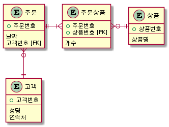

# 7. 정규화
정규화(Normalization)는 주로 데이터베이스 설계단계에 행해지는 것으로 중복을 줄일수 있도록 데이터를 구조화 하는 것을 말한다.
- 정규화는 관계성과 속성을 중점으로 조직화 하여 분류한다.  
- 중복을 피하고 조직적으로 분류된 객체들에 대해 데이터의 삽입, 삭제, 변경시에 효율적으로 무결성과 관련성을 관리할 수 있게 해준다.  
- 단순한 쿼리로 목적에 맞게 검색할 수 있으며 인덱스의 효율화할 수 있다.
- 결합(조인)을 통해 데이터를 재구성할 수 있으며 집계를 효율적으로 할 수 있다.

정규화는 제 6 정규화까지 정의되어 있는데 제 3 정규화를 통상적인 정규화 범위로 넣는다.  
그럼 예제를 통해 제 3 정규화까지 해보도록 하자.

일단 아래와 같은 주문 데이터들이 있다고 하자.

**주문 데이터**
주문번호 | 날짜 | 성명 | 연락처 | 주문상품
------- | -----| --- | ------ | -------
1 | 2017-10-01 | 김영희 | 010-1111-1111 | 0001::배::1,0002::사과::2
2 | 2017-10-02 | 박철수 | 010-1112-1111 | 0001::배::2,0002::사과::3
3 | 2017-10-03 | 김영희 | 010-1111-1111 | 0001::배::3,0003::딸기::1

이는 주문번호, 날짜, 성명, 연락처, 주문상품이라는 속성으로 구성되어 있으며  
주문상품은 콤마(,)를 구분자로 복수의 주문상품들이 나열되어 있다.  
또한 주문한 상품은 ::로 구분되어 상품번호, 상품명, 개수가 나열되어 있다.


## **7.1 제 1 정규화 (1NF)**
제 1 정규화는 속성들을 정리하여 정의하고 반복되는 속성들을 분류해    
새로운 엔티티(테이블)로 구성하고 본체와 1:N의 관계를 형성하도록 하는것을 말한다.

위의 주문 데이터를 보면 주문상품 부분이 속성 정리의 대상이 되는 것을 알 수 있다.
- 복수개의 상품이 존재
- 상품은 상품번호와 상품명과 개수로 구성되어 있다.

먼저 상품의 속성을 정리해 아래와 같이 기존의 속성을 재정의한다.  
```
주문번호 | 날짜 | 성명 | 연락처 | 주문상품 | 상품번호 | 상품명 | 개수
```
이후 위에 정의한 속성에 맞게 복수개의 상품을 행을 추가하는 형식으로 전개한다.  
위의 과정의 거치면 아래와 같은 형태의 주문 데이터가 만들어질 것이다.
주문번호 | 날짜 | 성명 | 연락처 | 주문상품 | 상품번호 | 상품명 | 개수
------- | -----| --- | ------ | ------- | ------- | ------ | ----
1 | 2017-10-01 | 김영희 | 010-1111-1111 | 0001 | 배 | 1
1 | 2017-10-01 | 김영희 | 010-1111-1111 | 0002 | 사과 | 2
2 | 2017-10-02 | 박철수 | 010-1112-1111 | 0001 | 배 | 2
2 | 2017-10-02 | 박철수 | 010-1112-1111 | 0002 | 사과 | 3
3 | 2017-10-03 | 김영희 | 010-1111-1111 | 0001 | 배 | 3
3 | 2017-10-03 | 김영희 | 010-1111-1111 | 0003 | 딸기 | 1

위의 데이터를 보면 주문에 관련된 내용(주문번호, 날짜, 성명, 연락처)가 중복되어 있는 것을 알 수 있다.  
또한 속성들을 살펴보면 주문에 관한것과 주문상품에 관한것으로 분류할 수 있다는 것을 알 수 있다.

그럼 두개의 엔티티(테이블)로 분류해 주문에 관한것은 중복으로 없애고  
주문상품에는 주문번호와 연관지어 1:N 관계를 만들수 있다.

**주문 테이블**
주문번호 | 날짜 | 성명 | 연락처 |
------- | -----| --- | ------ |
1 | 2017-10-01 | 김영희 | 010-1111-1111 |
2 | 2017-10-02 | 박철수 | 010-1112-1111 |
3 | 2017-10-03 | 김영희 | 010-1111-1111 |
※주문번호는 기본키로 지정할 수 있다.

**주문 상품 테이블**
주문번호 | 상품번호 | 상품명 | 개수
------- | ------- | ------ | ----
1 | 0001 | 배 | 1
1 | 0002 | 사과 | 2
2 | 0001 | 배 | 2
2 | 0002 | 사과 | 3
3 | 0001 | 배 | 3
3 | 0003 | 딸기 | 1
※주문번호와 상품번호를 묶어 기본키로 지정할 수 있다.

이로 주문 내역과 주문 상품 내역을 따로 쉽게 볼 수 있으며 주문번호별 주문 상품도 쉽게 검색할 수 있다.  
또한 두 테이블을 내부결합이나 외부결합하여 전체적인 상세 내역을 표시할 수도 있다.

## **7.2 제 2 정규화 (2NF)**
제 2 정규화 또한 중복되는 부분을 찾아 분할해 나가는데  
기본키에 특정되는 열과 그렇지 않은 열을 나누어 정규화를 진행한다.  
기본키가 두개의 열로 지정되는 경우가 이에 해당할 것이다.  
이를 부분 함수 종속성을 제거한다고 말한다.(키 값을 이용해 데이터를 특정짓기)

제 1 정규화를 한 상태에서 주문 상품 테이블이 그 대상이 된다.  
주문번호와 상품번호를 묶어 기본키로 지정할 수 있으며  
또한 주문한 상품이 주문 상품 테이블에 중복되어 저장되어 있는 것을 알 수 있다.  
이를 아래와 같이 주문 상품 테이블과 상품 테이블로 분리할 수 있다.

**주문 상품 테이블**
주문번호 | 상품번호 | 개수
------- | ------- | ----
1 | 0001 | 1
1 | 0002 | 2
2 | 0001 | 2
2 | 0002 | 3
3 | 0001 | 3
3 | 0003 | 1

**상품 테이블**
상품번호 | 상품명
------- | ------
0001 | 배
0002 | 사과
0003 | 딸기
※상품번호를 기본키로 지정할 수 있다.

## **7.3 제 3 정규화 (3NF)**
제 3 정규화 또한 중복되는 부분을 찾아 분할해 나가는데  
제 2 정규화에서 기본키에 중복여부를 중점으로 보았는데  
제 3 정규화에서는 기본키 이외의 부분에서 중복이 있는지를 조사한다.
다시말해 기본키에 의존하지 않고 일반 컬럼(열)에 의존하는 것을 분리한다.

주문 테이블을 보면  
주문 번호에 주문자의 성명과 연락처가 저장되어 있다.
이때 성명과 연락처는 하나의 묶음으로 연락처는 성명에 의존하는 관계이다.
그리고 주문 테이블의 기본키는 주문 번호로 성명은 일반 컬럼이다.
또한 같은 사람이 여러번 주문할 수 있으므로 중복될 수가 있다.

그럼 주문 테이블에서 주문자를 정보를 상품 테이블 처럼 고객 테이블로 분리해
고객번호를 기본키로 지정할 수 있다.

**주문 테이블**
주문번호 | 날짜 | 고객번호
------- | -----| --- |
1 | 2017-10-01 | 1
2 | 2017-10-02 | 2
3 | 2017-10-03 | 1

**고객 테이블**
고객번호 | 성명 | 연락처 |
------- | --- | ------ |
1 | 김영희 | 010-1111-1111 |
2 | 박철수 | 010-1112-1111 |
※고객번호는 기본키로 지정할 수 있다.

## **7.4 정리**
제 3 정규화를 통해 기존의 데이터를 아래와 같이 정규화하였다.

주문번호 | 날짜 | 성명 | 연락처 | 주문상품 | 상품번호 | 상품명 | 개수
------- | -----| --- | ------ | ------- | ------- | ------ | ----
1 | 2017-10-01 | 김영희 | 010-1111-1111 | 0001 | 배 | 1
1 | 2017-10-01 | 김영희 | 010-1111-1111 | 0002 | 사과 | 2
2 | 2017-10-02 | 박철수 | 010-1112-1111 | 0001 | 배 | 2
2 | 2017-10-02 | 박철수 | 010-1112-1111 | 0002 | 사과 | 3
3 | 2017-10-03 | 김영희 | 010-1111-1111 | 0001 | 배 | 3
3 | 2017-10-03 | 김영희 | 010-1111-1111 | 0003 | 딸기 | 1

**주문 테이블**
주문번호 | 날짜 | 고객번호
------- | -----| --- |
1 | 2017-10-01 | 1
2 | 2017-10-02 | 2
3 | 2017-10-03 | 1
※주문번호는 기본키로 지정할 수 있다.

**고객 테이블**
고객번호 | 성명 | 연락처 |
------- | --- | ------ |
1 | 김영희 | 010-1111-1111 |
2 | 박철수 | 010-1112-1111 |
※고객번호는 기본키로 지정할 수 있다.

**주문 상품 테이블**
주문번호 | 상품번호 | 개수
------- | ------- | ----
1 | 0001 | 1
1 | 0002 | 2
2 | 0001 | 2
2 | 0002 | 3
3 | 0001 | 3
3 | 0003 | 1
※주문번호와 상품번호를 묶어 기본키로 지정할 수 있다.

**상품 테이블**
상품번호 | 상품명
------- | ------
0001 | 배
0002 | 사과
0003 | 딸기
※상품번호를 기본키로 지정할 수 있다.

고객 테이블과 상품 테이블은 개별적으로 DML을 통해 관리할 수 있으며  
주문 테이블을 통해 주문 내역을 한눈에 알아 볼 수 있다.  
또한 주문 상품 테이블은 N:N의 관계로 주문과 상품을 이어주는 역할을 한다.

ER다이어그램으로 나타내면 아래와 같다.  

