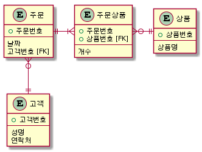

# 8. 예제실습
7장 정규화에서 다룬 내용으로 아래와 같은 테이블을 작성 및 검색을 실습해 보겠습니다.

**고객 테이블**

| 고객번호 | 성명 | 연락처 |
| ------- | --- | ------ |
| 1 | 김영희 | 010-1111-1111 |
| 2 | 박철수 | 010-1112-1111 |

※고객번호는 기본키로 지정할 수 있다.

**상품 테이블**

| 상품번호 | 상품명 |
| ------- | ------ |
| 0001 | 배 |
| 0002 | 사과 |
| 0003 | 딸기 |

※상품번호를 기본키로 지정할 수 있다.

**주문 테이블**

| 주문번호 | 날짜 | 고객번호 |
| ------- | -----| --- |
| 1 | 2017-10-01 | 1 |
| 2 | 2017-10-02 | 2 |
| 3 | 2017-10-03 | 1 |

※주문번호는 기본키로 지정할 수 있다.

**주문상품 테이블**

| 주문번호 | 상품번호 | 개수 |
| ------- | ------- | ---- |
| 1 | 0001 | 1 |
| 1 | 0002 | 2 |
| 2 | 0001 | 2 |
| 2 | 0002 | 3 |
| 3 | 0001 | 3 |
| 3 | 0003 | 1 |

※주문번호와 상품번호를 묶어 기본키로 지정할 수 있다.

### **1. 테이블 작성 하기**
위의 4개의 테이블을 작성해 봅니다.
기본키나 외부키를 지정도 해보세요

### **2. 테이블에 데이터 삽입 하기**
각 테이블에 데이터를 삽입해 봅니다.

### **3 주문한 고객정보 표시하기**
아래와 같이 주문한 고객정보를 출력하는 SELECT 문장을 작성해 봅니다.

| 주문번호 | 날짜 | 성명 | 연락처 |
| -------- | ---- | ---- | ------ |
| 1 | 2017-10-01 | 김영희 | 010-1111-1111 |
| 2 | 2017-10-02 | 박철수 | 010-1112-1111 |
| 3 | 2017-10-03 | 김영희 | 010-1111-1111 |

### **4 주문상품 상품정보 표시하기**
아래와 같이 주문상품의 상품정보를 출력하는 SELECT 문장을 작성해 봅니다.

| 주문번호 | 상품명 | 개수 |
| -------- | ------ | ---- |
| 1 | 배 | 1 |
| 1 | 사과 | 2 |
| 2 | 배 | 2 |
| 2 | 사과 | 3 |
| 3 | 배 | 3 |
| 3 | 딸기 | 1 |

### **5 주문상품 상세 내역 표시하기**
아래와 같이 주문상품의 상세 내역을 출력하는 SELECT 문장을 작성해 봅니다.

| 주문번호 | 날짜| 성명 | 연락처 | 상품명 | 개수 |
| -------- | --- | ---- | ------ | ------ | ---- |
| 1 | 2017-10-01 | 김영희 | 010-1111-1111 | 배 | 1 |
| 1 | 2017-10-01 | 김영희 | 010-1111-1111 | 사과 | 2 |
| 2 | 2017-10-02 | 박철수 | 010-1112-1111 | 배 | 2 |
| 2 | 2017-10-02 | 박철수 | 010-1112-1111 | 사과 | 3 |
| 3 | 2017-10-03 | 김영희 | 010-1111-1111 | 배 | 3 |
| 3 | 2017-10-03 | 김영희 | 010-1111-1111 | 딸기 | 1 |

### **6 고객별 구매한 총 상품 개수 표시하기**
고객별 구매한 총 상품의 개수를 출력하는 SELECT 문장을 작성해 봅니다.

| 고객번호 | 성명 | 연락처 | 구매한 총 상품 개수 |
| -------- | ---- | ------ | ------------------- |
| 1 | 김영희 | 010-1111-1111 | 7 |
| 2 | 박철수 | 010-1112-1111 | 5 |
